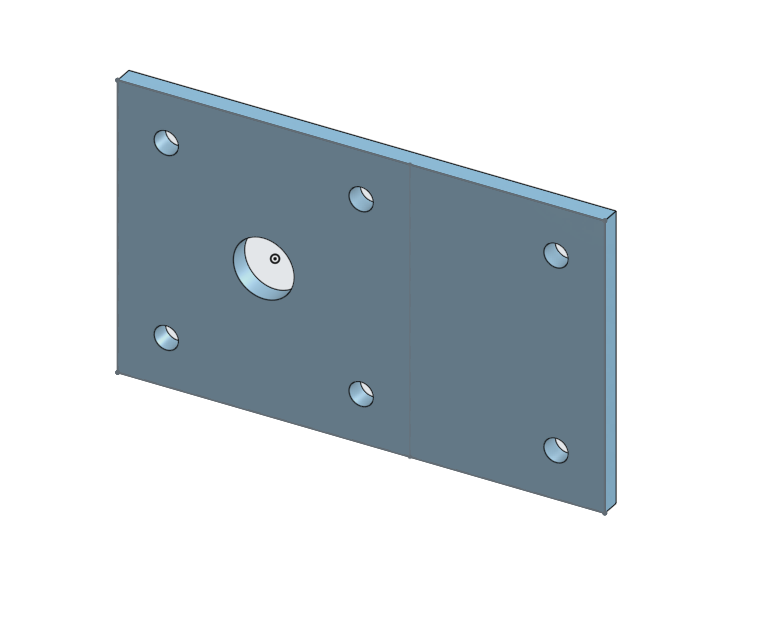
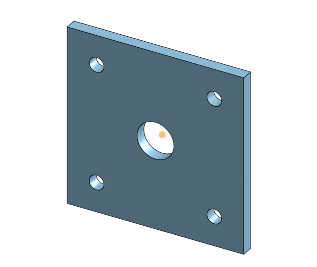
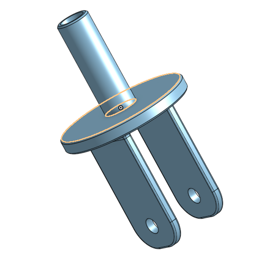
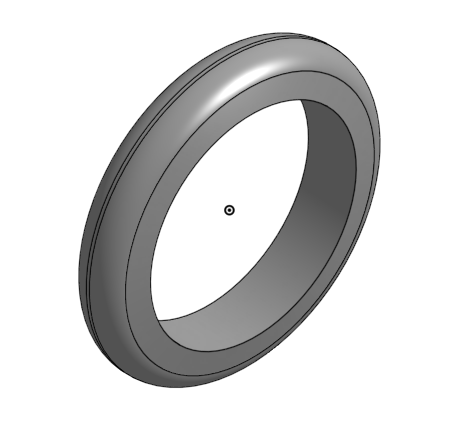
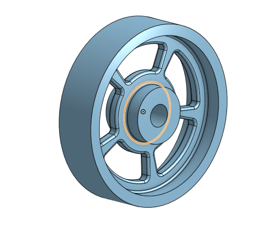
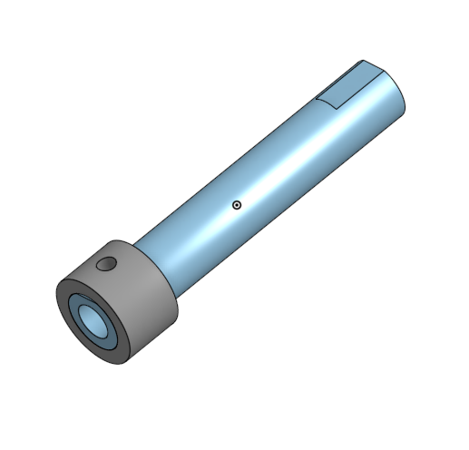
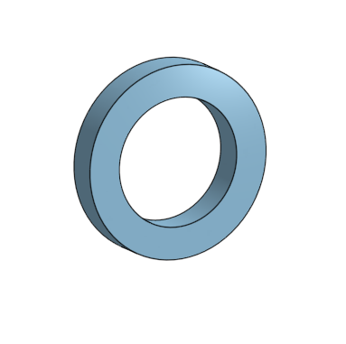

# Onshape
Here is an image file for that image to github assignment.

## I Present, El Perro...

## Part 1: Base

Onshape link: https://cvilleschools.onshape.com/documents/5ef2f9113ac8b7511dc2a445/w/5ce21578b1ed5a99e828411a/e/1bea44fded17ffc1435e9b8a

### Reflection

## Part 2: Mount

Onshape link: https://cvilleschools.onshape.com/documents/db8cdd9beff629a265bd6512/w/210b3295f090da78f83edbbc/e/d52fb48fbe3c0ead1ba3ecce

### Reflection:

## Part 3: Fork

Onshape link: https://cvilleschools.onshape.com/documents/451b58e515dcd6e305f04a41/w/de628aee08f5e3af5d1f5e52/e/7f3704b01adc27b0922d4c84

### Reflection:

## Part 4: Tire

Onshape link: https://cvilleschools.onshape.com/documents/00b625b8f5eadd3716503934/w/b93bb4586a611c45ea7c1bd4/e/09d44e350091b6e30f6eddc1

### Reflection:

## Part 5: Wheel

Onshape link: https://cvilleschools.onshape.com/documents/e0f32e3f7a6ebea4a8ddf7de/w/b128b4ce297fbe63cd82a510/e/b99aa92059ef597bbe2255d6

### Reflection:

## Parts 6-9: Axle, Collar, Bearings

Onshape link to Axle + Collar: https://cvilleschools.onshape.com/documents/e94e5a4e80772d34ba6a868d/w/aab7fbfa7eca113a61010da5/e/e6012cb25396623ff64c4e44
Onshape link to Bearing: https://cvilleschools.onshape.com/documents/ae8896e3ab0cc435b92925d7/w/3cf249e9880938799883782d/e/841f151a6954d409697adfe4

### Reflection:

