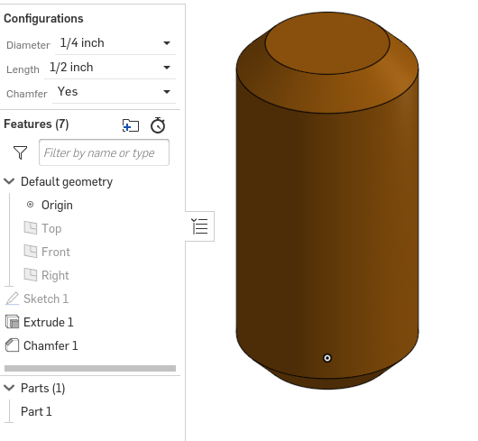

# Onshape
Here is an image file for that image to github assignment.

## I Present, El Perro...

# Caster

## Part 1: Base

Onshape link: https://cvilleschools.onshape.com/documents/5ef2f9113ac8b7511dc2a445/w/5ce21578b1ed5a99e828411a/e/1bea44fded17ffc1435e9b8a

### Reflection
For all engineering students transitioning to Onshape, one thing helped me the most in making these assignments quicker and easier. Learining the keyboard shortcuts for actions/tools such as starting a sketch (ctrl-s), line tool (l), construction (q), hide/show planes (p), and dimension (d). Memorizing the keyboard shortcuts for these and other commands make projects go a lot faster, so you can take less time constructing things and complete them easier. You can find a list of the keyboard shortcuts by clicking the "?" button on the top right of the screen in Onshape.

## Part 2: Mount

Onshape link: https://cvilleschools.onshape.com/documents/db8cdd9beff629a265bd6512/w/210b3295f090da78f83edbbc/e/d52fb48fbe3c0ead1ba3ecce

### Reflection:
The best method for completing the mount quickly was definitely the last part of the instructional video on Canvas where Mr Shields talks about the USE tool. Its symbol is a cube on the toolbar. The USE command helps you incorporate existing lines and features into your new sketch without having to construct them again. This speeds things up quite considerably, so I recommend before you complete this assignment to look up how the USE tool works in Onshape. 

## Part 3: Fork

Onshape link: https://cvilleschools.onshape.com/documents/451b58e515dcd6e305f04a41/w/de628aee08f5e3af5d1f5e52/e/7f3704b01adc27b0922d4c84

### Reflection:
I would like to feature the tool "tangent propogation" in my reflection for this part. Tangent propogation is an option you can select when fileting/chamfering an edge that has adjacent edges to it. Instead of fileting/chamfering each edge individual like in Solidworks, this option will filet/chamfer all connected edges at the same time. Having this option in Solidworks last year would've probably saved me a week of work on my project.

## Part 4: Tire

Onshape link: https://cvilleschools.onshape.com/documents/00b625b8f5eadd3716503934/w/b93bb4586a611c45ea7c1bd4/e/09d44e350091b6e30f6eddc1

### Reflection:
One problem I had at first when I was making the tire was that the two angular edges of the revolve profile would not become fully constrained. In order to constrain both edges before I could revolve the sketch, you have to have a construction line in the middle of the two lines so you can make them symmetric. This will fully constrain those edges and allow you to move on.

## Part 5: Wheel

Onshape link: https://cvilleschools.onshape.com/documents/e0f32e3f7a6ebea4a8ddf7de/w/b128b4ce297fbe63cd82a510/e/b99aa92059ef597bbe2255d6

### Reflection:
One detail I found when making this part was fileting faces was much more efficient than singular edges. When I was fileting the edges to the spokes of the wheel, instead of going through to each set of connected edges and using filet -> tangent propogation to filet them at one time, I could click the face of the wheel, in it selects every edge on that face to filet it at the same time. In order to fully filet the wheel, you must click both sides.

## Parts 6-9: Axle, Collar, Bearings

Onshape link to Axle + Collar: https://cvilleschools.onshape.com/documents/e94e5a4e80772d34ba6a868d/w/aab7fbfa7eca113a61010da5/e/e6012cb25396623ff64c4e44
Onshape link to Bearing: https://cvilleschools.onshape.com/documents/ae8896e3ab0cc435b92925d7/w/3cf249e9880938799883782d/e/841f151a6954d409697adfe4

### Reflection:
I don't think I really learned anything new about Onshape from making these parts, but I did end up needing the USE command again. It is a very useful tool, make sure you know how to use it when going through these parts.

# Dorothy's Dowel Pins

## Description:

## Link to the Document: https://cvilleschools.onshape.com/documents/ee4c25a53f5a2441ab3b0dd3/w/2d4dca748608c0aff44881ac/e/1ab292ac7d2d81ff9fff38cd?configuration=List_KlDImR5Duk1y2h%3DDefault%3BList_sxPoePCoYkGxAy%3DDefault%3BList_v33P1anx6ZGAHo%3DDefault

## Picture:

## Lessons learned:
