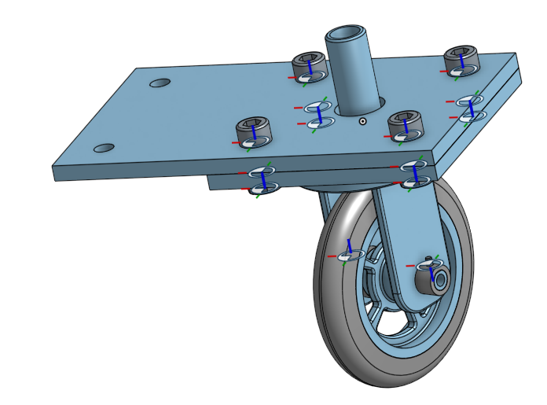

# Onshape
---

# Table of Contents

1. [Caster](#Caster)
2. [Mount](## Part 2: Mount)

# Caster

## Part 1: Base

Onshape link: https://cvilleschools.onshape.com/documents/5ef2f9113ac8b7511dc2a445/w/5ce21578b1ed5a99e828411a/e/1bea44fded17ffc1435e9b8a

### Reflection
For all engineering students transitioning to Onshape, one thing helped me the most in making these assignments quicker and easier. Learining the keyboard shortcuts for actions/tools such as starting a sketch (ctrl-s), line tool (l), construction (q), hide/show planes (p), and dimension (d). Memorizing the keyboard shortcuts for these and other commands make projects go a lot faster, so you can take less time constructing things and complete them easier. You can find a list of the keyboard shortcuts by clicking the "?" button on the top right of the screen in Onshape.

## Part 2: Mount

Onshape link: https://cvilleschools.onshape.com/documents/db8cdd9beff629a265bd6512/w/210b3295f090da78f83edbbc/e/d52fb48fbe3c0ead1ba3ecce

### Reflection:
The best method for completing the mount quickly was definitely the last part of the instructional video on Canvas where Mr Shields talks about the USE tool. Its symbol is a cube on the toolbar. The USE command helps you incorporate existing lines and features into your new sketch without having to construct them again. This speeds things up quite considerably, so I recommend before you complete this assignment to look up how the USE tool works in Onshape. 

## Part 3: Fork

Onshape link: https://cvilleschools.onshape.com/documents/451b58e515dcd6e305f04a41/w/de628aee08f5e3af5d1f5e52/e/7f3704b01adc27b0922d4c84

### Reflection:
I would like to feature the tool "tangent propogation" in my reflection for this part. Tangent propogation is an option you can select when fileting/chamfering an edge that has adjacent edges to it. Instead of fileting/chamfering each edge individual like in Solidworks, this option will filet/chamfer all connected edges at the same time. Having this option in Solidworks last year would've probably saved me a week of work on my project.

## Part 4: Tire

Onshape link: https://cvilleschools.onshape.com/documents/00b625b8f5eadd3716503934/w/b93bb4586a611c45ea7c1bd4/e/09d44e350091b6e30f6eddc1

### Reflection:
One problem I had at first when I was making the tire was that the two angular edges of the revolve profile would not become fully constrained. In order to constrain both edges before I could revolve the sketch, you have to have a construction line in the middle of the two lines so you can make them symmetric. This will fully constrain those edges and allow you to move on.

## Part 5: Wheel

Onshape link: https://cvilleschools.onshape.com/documents/e0f32e3f7a6ebea4a8ddf7de/w/b128b4ce297fbe63cd82a510/e/b99aa92059ef597bbe2255d6

### Reflection:
One detail I found when making this part was fileting faces was much more efficient than singular edges. When I was fileting the edges to the spokes of the wheel, instead of going through to each set of connected edges and using filet -> tangent propogation to filet them at one time, I could click the face of the wheel, in it selects every edge on that face to filet it at the same time. In order to fully filet the wheel, you must click both sides.

## Parts 6-9: Axle, Collar, Bearings

Onshape link to Axle + Collar: https://cvilleschools.onshape.com/documents/e94e5a4e80772d34ba6a868d/w/aab7fbfa7eca113a61010da5/e/e6012cb25396623ff64c4e44
Onshape link to Bearing: https://cvilleschools.onshape.com/documents/ae8896e3ab0cc435b92925d7/w/3cf249e9880938799883782d/e/841f151a6954d409697adfe4

### Reflection:
I don't think I really learned anything new about Onshape from making these parts, but I did end up needing the USE command again. It is a very useful tool, make sure you know how to use it when going through these parts.

# Dorothy's Dowel Pins

## Description:
For the Dorothy's Dowel Pins assignment I made a dowel in onshape, and I used configurations to quickly make different models of the same dowel design. I configured the length, diameter, and the chamfer of the same dowel pin to be able to select the specific features I wanted for each dowel.
For
## Link to the Document:
https://cvilleschools.onshape.com/documents/ee4c25a53f5a2441ab3b0dd3/w/2d4dca748608c0aff44881ac/e/1ab292ac7d2d81ff9fff38cd?configuration=List_KlDImR5Duk1y2h%3DDefault%3BList_sxPoePCoYkGxAy%3DDefault%3BList_v33P1anx6ZGAHo%3DDefault

## Picture:

## Lessons learned:
I think the biggest thing after seeing how configurations work in Onshape is to think about other ways this tool can be applied. I think this feature could be used in the auto industry for making cars with different features or add-ons from the base model. For example, getting a Honda CRV with or without paying extra for a rear camera, or paying for an automatic or manual transition. Maybe an add-on could be the seats are more plush. These are ways I could see using configurations in Onshape would be very helpful.

# Onshape Fundamentals: Assemblies Exercise

## Description:
For this assignment I made a copy of the exercise document and reassembled the hydrualic clamp assembly. I learned how to use the different types of mates in Onshape and what they each did. I also learned how to put limits on mates.

## Link to the Document:
https://cvilleschools.onshape.com/documents/d42a8ea8c74bc88f57fcbabf/w/9b792ed8d9e42a37dfc34a2d/e/2df0a49f7ac193c3fdc24f6b

## Picture:

## Lessons learned:
The most important lesson I learned is to make sure you know the level or freedom of movement that each mate allows so you immediately know which mate to use. For example, when you are mating a cylinder into a hole, you must know whether to use the sliding mate (moves in/out), the cylinder mate (slides in/out and rotates), or the revolute mate (doesn't slide in/out but it rotates). When you are learning the mates, you can use the arrows in each mate's icon on the toolbar for reference.

# Onshape Challenge

## Description:
The Onshape Challenge was creating a mount with 2 spinner shafts angled to each other that turn each other like gears, connected by a cube with pegs attached to each spinner shaft.

## Link to the Document:
https://cvilleschools.onshape.com/documents/5f526b902b45e2681bac54fa/w/badd770be56835cfae57a3d7/e/004cba2f87c3dfe6440f727c

## Picture:

## Lessons learned:
I think the biggest thing you can learn from this assignment is the fluid transfer of motion from one direction to the opposite direction. This is a way to change to the direction without gears, helpful for projects involving fans or wheels where the transfer of motion isn't in-line, it's on an angle. An example would be a transfer of motion from a truck engine with a central rod turning left to right, using this change of direction to turn the back axle front to back.

# Sub-Assembly

## Description:
For the sub-assembly assignment, I made an axle and bearings for the wheel. Then I created an assembly, putting together the wheel, tire, axle, and bearings. My sub assembly is now ready to be put together with the base, mount, and fork.

## Link to the Document:
https://cvilleschools.onshape.com/documents/48a3fd0b310ca157286235e9/w/642a13d0804e66f2bf0e1232/e/0a7b7f92519d9dca42e458bf

## Picture:

## Lessons learned:
In this assignment when you are making the axle, it has cuts in each end forming small flat surfaces. These flat surfaces on the axle allow for pins or threaded screws to push into the axle and hold it from spinning with the wheel. Here are some pictures of the collar and axle by themselves.

# Final Caster Assembly

## Description:
The Final Caster Assembly was just making and putting together the assembly of the Base, Mount, Fork, Wheel, Tire, Axle, collars and bearings. These parts were assembled together using screws, bolts, pins and nuts from Onshape's standard content toolbox. 

## Link to the Document:
https://cvilleschools.onshape.com/documents/c7005314f58c87ce564a4dc5/w/e8a9f2c39108efc13bcee186/e/0ae30d16934c4b47c1077725

## Picture:

## Lessons Learned:
An important lesson I learned from the Final Caster Assembly is how to insert standardized bolts, nuts and other common fasteners. You can insert these into an assembly by using INSERT, and then clicking STANDARD CONTENT. Here you can select the specific type of part you need, then the length, diamter, and size. Inserting these fasteners into your assembly when working on a project allow you to realistically put together your product in CAD utilizing the same bolts, nuts, screws, etc. that you will need when phyiscally putting it together.

